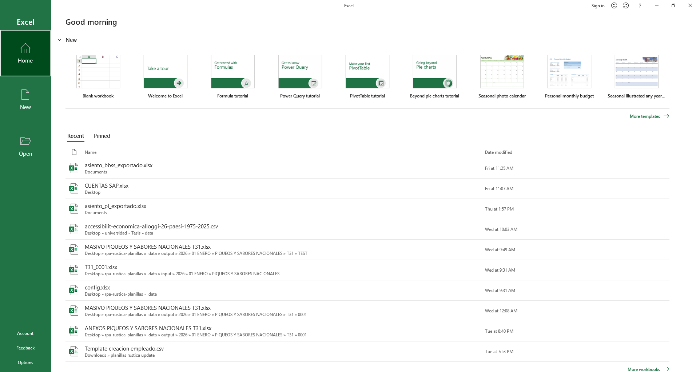
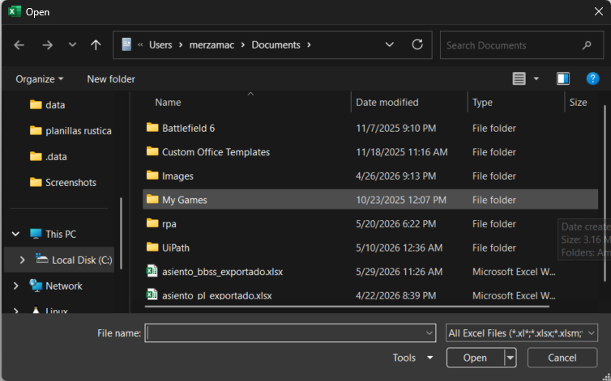
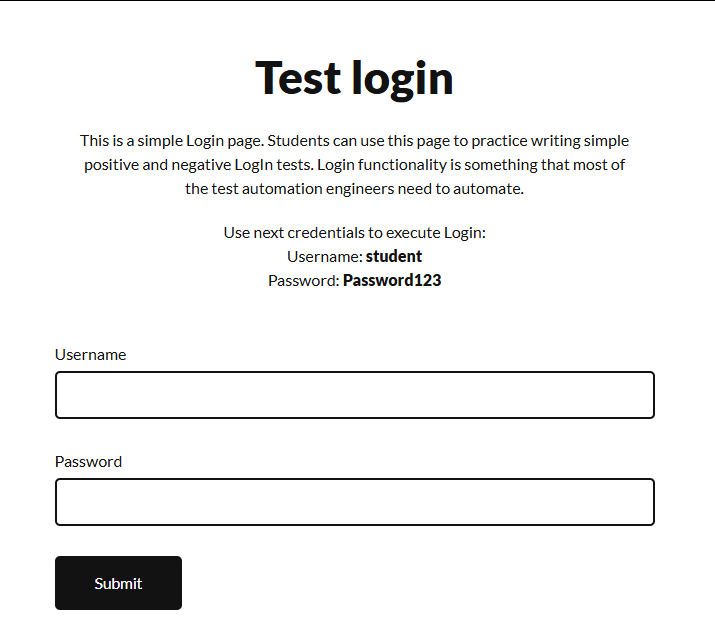
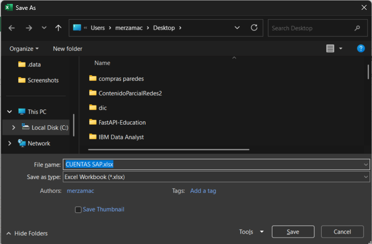

# Automatización y Procesamiento en Microsoft Excel

## 1. Introducción y Objetivos

Este documento describe la arquitectura, los requisitos de configuración y el flujo operativo del sistema de automatización desarrollado para el procesamiento de archivos de Microsoft Excel.

El diseño del software se ha alineado con las mejores prácticas de ingeniería, mitigando el impacto de la **automatización frágil** mediante el uso de **Programación Orientada a Objetos (POO)** y principios de **Código Limpio (Clean Code)**. El sistema está estructurado para ser altamente escalable, garantizando interacciones predecibles y un manejo robusto de los estados de la interfaz de usuario.

---

## 2. Prerrequisitos e Instalación

Para garantizar un entorno aislado, reproducible y libre de conflictos de dependencias, el proyecto utiliza **PDM** (Python Development Master) como gestor de paquetes.

### 3: Configuración del Entorno de Desarrollo (CMD)

Abra la consola de comandos de Windows (`cmd`) y ejecute la siguiente secuencia para instalar las herramientas base del sistema:

```bash
# Instalar pipx para la gestión de aplicaciones CLI globales
pip install pipx

# Configurar de forma automática las variables de entorno (PATH)
pipx ensurepath

# Instalar PDM de manera aislada en el sistema
pipx install pdm
```

> **Nota:** Si los comandos de `pdm` no son reconocidos inmediatamente después de la instalación, reinicie la consola de comandos para actualizar las variables de entorno.

## 4: Despliegue del Proyecto e Instalación de Dependencias

Una vez preparado el sistema base, configure el repositorio local:

1. Acceda al directorio raíz donde se ha copiado o clonado este repositorio.
2. Ejecute el siguiente comando para inicializar el entorno virtual e instalar las dependencias del proyecto de forma automatizada:

```bash
pdm install
```

## 5. Flujo Operacional de la Automatización

El proceso emula de extremo a extremo la interacción del usuario con el sistema operativo y la aplicación de escritorio a través de las siguientes etapas secuenciales:

### 5.1. Inicialización de la Aplicación

El script inicia una instancia controlada de Microsoft Excel, validando que el proceso se ejecute correctamente en el sistema.



### 5.2. Importación Dinámica de Archivos

Se invoca de forma programática el explorador de archivos nativo para localizar, seleccionar y cargar el libro de trabajo requerido dentro de la aplicación.



### 5.3. Autenticación de Usuario (Login)

Con el documento base cargado, el sistema interactúa con la interfaz de seguridad para realizar el login correspondiente.



**URL del Servicio:** [Login](https://practicetestautomation.com/practice-test-login/)

### 5.4. Captura y Vinculación del Manejador de Ventana

Tras un login exitoso, el script captura explícitamente el identificador de la ventana activa del Excel importado. Esto asegura que cualquier interacción subsiguiente se dirija estrictamente a ese documento, evitando errores por pérdida de foco.

### 5.5. Procesamiento y Exportación Segura

Se realizan las operaciones planificadas sobre las hojas de cálculo y se ejecuta la acción "Guardar como" para persistir los cambios.


> **Regla de Negocio Crítica:** Para mantener la integridad de la información y evitar la sobreescritura accidental, la ruta de exportación de destino debe ser diferente a la ruta de origen del archivo.

## 6. Requerimientos de Desarrollo y Buenas Prácticas

Para garantizar la mantenibilidad y la robustez del proyecto, todo el código desarrollado debe cumplir estrictamente con los siguientes pilares de ingeniería de software:

### 6.1. Calidad y Arquitectura del Código

- **Código Limpio (Clean Code):** Aplicar legibilidad, nombres descriptivos para variables/funciones y funciones de responsabilidad única.
- **Escalabilidad:** El diseño debe permitir el crecimiento del sistema (en funciones y volumen de datos) sin necesidad de rediseñar la estructura base.
- **Programación Orientada a Objetos (POO):** Modularizar el sistema utilizando clases, encapsulamiento y abstracción para representar las entidades del negocio.

### 6.2. Gestión de Archivos y Rutas

- **Uso de `pathlib`:** Queda estrictamente prohibido el uso de strings manuales o el módulo antiguo `os.path` para manipular rutas. Se debe emplear la librería estándar `pathlib` de Python para asegurar la compatibilidad entre sistemas operativos (Windows, Mac, Linux).
- **Acceso Indirecto:** Evitar abrir o ejecutar archivos directamente a través de la aplicación principal sin capas de validación previas.

### 6.3. Robustez del Sistema

> ⚠️ **Cuidado con la automatización frágil (Fragile Automation):**

Se deben anticipar fallos del entorno, cambios en la UI de terceros, problemas de red o variaciones en los formatos de entrada. Toda automatización debe incluir:

- Un manejo de excepciones sólido
- Logs detallados
- Mecanismos de recuperación (reintentos)

Esto para evitar que el flujo se rompa ante el mínimo cambio.
